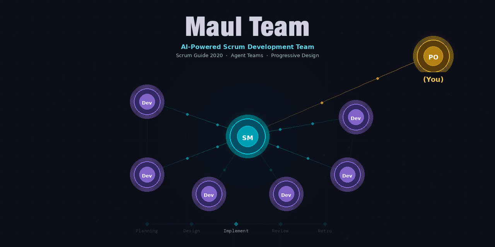
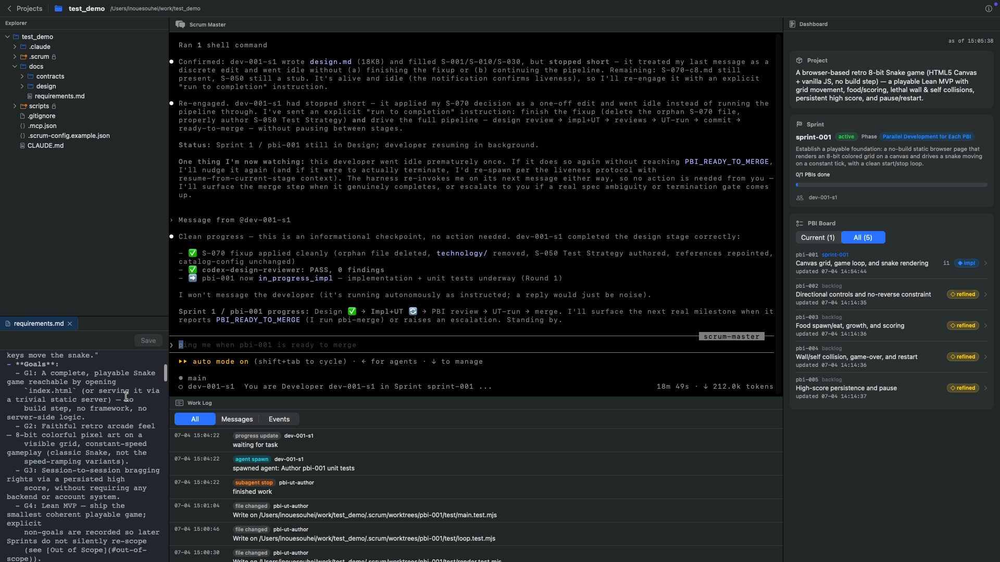

<p align="center">
  
</p>

<h1 align="center">Maul Team</h1>

<p align="center">
  <strong>An AI Scrum team for Claude Code — multi-agent coordination via Agent Teams drives your entire Scrum workflow</strong>
</p>

<p align="center">
  <a href="#license"></a>
  
  
  
  
  
</p>

<p align="center">
  <strong>English</strong> | <a href="README_ja.md">日本語</a>
</p>

<p align="center">
  <a href="#why">Why?</a> &bull;
  <a href="#demo">Demo</a> &bull;
  <a href="#get-started">Get Started</a> &bull;
  <a href="#features">Features</a> &bull;
  <a href="#command-line-advanced">Command line</a> &bull;
  <a href="#architecture">Architecture</a> &bull;
  <a href="#development">Development</a>
</p>

---

Open a project in **MaulTeam.app** (or run `scrum-start.sh` from a terminal) and a full AI Scrum team takes over — a **Scrum Master** coordinates **Developer** agents through Sprint cycles while you act as the **Product Owner**, approving goals and reviewing the working product.

## Why?

Vibe coding's speed is attractive, but order erodes as a project runs longer. Spec-Driven Development (SDD) keeps order well, but demands defining a lot upfront. Most real projects live in between — not everything is decided on day one, yet you still need to maintain order as you go.

**Maul Team** brings Scrum's inspect-and-adapt loop to Claude Code, giving you structured iteration without requiring a complete specification on day one. You stay in the Product Owner seat — describing what you want, approving Sprint Goals, and reviewing working software each Sprint — while a team of AI agents handles the rest.

## Demo

<p align="center">
  
</p>

https://github.com/user-attachments/assets/550ae9d2-f936-4087-838e-ba683b684aae

**MaulTeam.app** brings the information and controls you need for Scrum development into a single window.

Pick or create a project, then talk to the Scrum Master in the embedded terminal. A native dashboard shows Product and Sprint status, the PBI list, and progress — and you can watch agent activity and the code being generated.

## Get Started

The easiest way in is the **Mac App** — a native macOS app that wraps the whole framework. On Linux, or if you prefer a terminal, you can also use the [command line](#command-line-advanced).

### Install (early access — build from source)

> TODO: enumerate the Mac App install methods (.dmg, Homebrew, GitHub release)

**Requirements:**

> TODO: a local build shouldn't be required — narrow this to the OS/library prerequisites for *running* the Mac App. List Codex as optional-but-recommended.

| Requirement | Version | Purpose / notes |
|------|-----------|-----------|
| **macOS + Xcode** | macOS 13+ / Xcode 15+ (Swift 5.9+) | For the source build; the first build needs network access to fetch [SwiftTerm](https://github.com/migueldeicaza/SwiftTerm) |
| **Claude Code CLI** | 2.1.172 or later (on PATH) | The app runs `scrum-start.sh`, whose PBI pipeline relies on sub-agents spawning further sub-agents (unlocked in 2.1.172). See [Claude Code version](#claude-code-version) |
| **Python** | 3.9+ | `scrum-start.sh` validates it at launch and installs `textual` + `watchdog` if missing (the Mac App's dashboard is native SwiftUI, but the launcher still checks these) |

See [macapp/README.md](macapp/README.md) for the full architecture — editor, background sessions, bundled-framework resolution, and distribution status.

### What a Sprint looks like

1. **Co-author a product brief** — for a new project, `docs/product/brief.md` is co-written interactively; the brief becomes the foundation for everything that follows
2. **Requirement Definition** — the Scrum Master spawns a Requirements Analyst to elicit requirements and write `requirements.md`
3. **Backlog Refinement** — the SM creates and refines PBIs from your requirements
4. **Sprint Planning** — the SM proposes a Sprint Goal; you approve or adjust
5. **PBI Development (parallel, per-PBI)** — each Developer acts as a conductor running the `pbi-pipeline` skill on its assigned PBI in its own git worktree (`.scrum/worktrees/<pbi-id>/`, branch `pbi/<pbi-id>`): rounds of design → implementation + black-box UT → cross-model (Codex) review, with deterministic termination gates and real C0/C1 coverage; before ready-to-merge, an Integrity stage runs 5 aspect reviewers (requirement-conformance, functional-quality, security, maintainability, docs-consistency) over the PBI's diff. The SM merges each PBI on completion.
6. **Cross-Review** — once all PBIs are merged, the SM runs an audit-only cross-review: a whole-repo 4-axis `codebase-audit` (spec-conformance, logic-defect, redundancy, product-security). It is non-blocking — Critical/High findings become draft PBIs for the next Sprint
7. **Sprint Review** — the SM launches the app and demos each completed PBI in turn; you confirm each works
8. **Retrospective** — the team reflects and records improvements for future Sprints
9. **Repeat** from step 3 until the Product Goal is achieved; then advance to the two closing phases:
10. **Integration Tests** — derive boundary-value and branch-coverage test cases from the design specs and run them (smoke + API/UI automation)
11. **UAT & Release** — a user-story-driven UAT and the go/no-go release decision

## Your role as Product Owner

| You do | The AI team does |
|--------|-----------------|
| Describe what you want to build | Elicit and write detailed requirements |
| Approve Sprint Goals | Plan Sprints and assign PBIs |
| Review demos in the running app | Design and implement the Increment, and run cross-review |
| Report defects during UAT | Fix defects and re-test |
| Make release decisions | Run automated test suites |

> The PO seat can also be delegated to the `product-owner` agent via `po_mode=agent` (autonomous mode). See [docs/autonomous-mode.md](docs/autonomous-mode.md).

## Features

- **Native Mac app** — MaulTeam.app runs the whole team in one macOS window (project picker, embedded Scrum Master terminal, tabbed code editor, native dashboard)
- **19 Skills** covering the full Scrum lifecycle: product-brief co-authoring, requirements elicitation, backlog refinement, sprint planning, PBI Development (design + impl + UT + per-PBI review), per-PBI merge, cross-review (whole-repo codebase audit), sprint review, retrospective, integration testing, and UAT & release
- **Multi-agent coordination** — the Scrum Master (Delegate mode) orchestrates up to 6 parallel Developers per Sprint (1 Developer per PBI, capped at 6)
- **Autonomous PO mode** — replace even the PO with an AI Product Owner to drive development end-to-end. An outer Ralph-Loop watchdog re-launches headless Claude sessions, enforcing safety valves while writing reports to `.scrum/reports/`. See [docs/autonomous-mode.md](docs/autonomous-mode.md)
- **Design document governance** — an immutable catalog (`catalog.md`) plus an editable enablement config (`catalog-config.json`), enforced by status-gate hooks, control the documents AI agents are allowed to create
- **Quality enforcement hooks** — status gates, path guards, branch-ops guard, completion-flow enforcement (`stop-dispatch.sh` → `dashboard-event.sh` + `completion-gate.sh`), quality gates (Definition of Done), session context restoration, plus an external stall watchdog (`scripts/stall-watchdog.sh`) in human mode — turning the behaviors you want agents to follow into mechanisms
- **State persistence** — all state is saved to `.scrum/` JSON files; sessions resume
- **Retrospective-driven improvement** — improvements from past Sprints are applied automatically
- **Automated testing** — Integration Tests derives design-driven test cases covering boundary values and flow/pattern branches on top of smoke tests (unit + e2e), automated as committable API + Playwright UI tests; UAT & Release then runs a story-driven UAT (Playwright MCP / Chrome DevTools MCP-assisted) and the release decision

### AI-Specific Adaptations

This is not a carbon copy of human Scrum — it adapts the framework to how AI agents actually work.

**Extensions leveraging AI strengths:**

- **Dynamic team sizing** — the number of Developer agents is optimized per Sprint based on PBI count and complexity
- **Two-tier independent review** — every PBI passes a 5-aspect Integrity gate (`requirement-conformance`, `functional-quality`, `security`, `maintainability`, `docs-consistency` reviewers over its diff) before merge, then a Sprint-end whole-repo 4-axis codebase audit (spec-conformance, logic-defect, redundancy, product-security) sweeps the entire Increment — plus per-PBI Codex-CLI cross-model review

**Constraints addressing AI weaknesses:**

- **Mandatory Requirement Definition** — the first Sprint (Sprint 0) is dedicated solely to requirements elicitation, preventing the team from charging ahead without a map
- **No work without a PBI** — all development must be tied to a backlog item, stopping the Scrum Master from drifting into ad-hoc fixes mid-conversation
- **Controlled document creation** — only document types listed in the design catalog may be created, curbing the AI tendency to produce sprawling, unstructured documentation
- **PO-driven Sprint scope** — Sprint boundaries are set by meaningful review checkpoints rather than velocity estimates, since AI agents have no stable velocity baseline

### Sprint Lifecycle

```
 ┌─────────────────────────────────────────────────────────────┐
 │  Requirement Definition (Sprint 0)                          │
 │  Requirements Elicitation ──▶ Initial Product Backlog       │
 └──────────────────────────────┬──────────────────────────────┘
                                ▼
 ┌─────────────────────────────────────────────────────────────┐
 │  Sprint N                                                   │
 │                                                             │
 │  1. Backlog Refine    PBIs: draft ──▶ refined               │
 │          ▼                                                  │
 │  2. Planning          PO approves Sprint Goal               │
 │          ▼                                                  │
 │  3. Scaffold Specs    Create design doc stubs from catalog  │
 │          ▼                                                  │
 │  4. Spawn Teammates   Launch Developer agents + worktrees   │
 │          ▼                                                  │
 │  5. PBI Pipeline      Per Developer / per PBI, in parallel: │
 │                         design → impl + black-box UT →      │
 │                         cross-model (Codex) review, with    │
 │                         deterministic termination gates     │
 │                         and real C0/C1 coverage,            │
 │                         then a 5-aspect Integrity stage     │
 │          ▼                                                  │
 │  6. Per-PBI Merge     SM merges each ready PBI immediately  │
 │                         (--no-ff + regression gate;         │
 │                         3-strike escalation)                │
 │          ▼                                                  │
 │  7. Cross-Review      Whole-repo 4-axis codebase-audit      │
 │                         (audit-only, non-blocking;          │
 │                         findings → next-Sprint draft PBIs)  │
 │          ▼                                                  │
 │  8. Sprint Review     Demo to PO, accept/reject PBIs        │
 │          ▼                                                  │
 │  9. Retrospective     Record improvements for next Sprint   │
 └──────────┬──────────────────────────┬───────────────────────┘
            │                          │
            ▼                          ▼
     Next Sprint N+1   ┌──────────────────────────────┐   ┌──────────────────────────┐
                       │  Integration Tests           │──▶│  UAT & Release           │
                       │  Smoke ──▶ Design-Driven     │   │  Story-Driven UAT ──▶    │
                       │  Cases ──▶ Stub/Automate     │   │  Release Decision        │
                       └──────────────────────────────┘   └──────────────────────────┘
```

## Command line (advanced)

Prefer a terminal, or want to run headless, remote, or on Linux? The same framework runs from the shell.

```bash
# Clone the repository
git clone git@github.com:sohei56/maul-team.git

# In your project directory:
cd /path/to/your/project

# Launch the Scrum team (auto-installs Python dependencies if needed)
sh /path/to/maul-team/scrum-start.sh

# Or: launch in autonomous PO mode (no human at the keyboard)
sh /path/to/maul-team/scrum-start.sh --autonomous --brief docs/product/brief.md
```

The script launches a tmux session with Claude Code (the Scrum Master) and the TUI dashboard.

<p align="center">
  
</p>

> Already deployed this framework to a project before? Re-run `scrum-start.sh` to refresh `.claude/` — it is a copied snapshot, not a live link, so changes to Skills and the like only take effect after a re-run.

For detailed setup, see [quickstart.md](docs/quickstart.md); for autonomous-mode operation (safety valves, Stop-block budgets, morning report), see [docs/autonomous-mode.md](docs/autonomous-mode.md).

### Command-line prerequisites

- **Claude Code CLI** ≥ **2.1.172** and **Python 3.9+** — see the shared prerequisites under [Get Started](#install-early-access--build-from-source)
- **tmux** (recommended) for the side-by-side dashboard layout

#### Claude Code version

`scrum-start.sh` emits a warning when Claude Code is older than **2.1.172**. **Sub-agents spawning further sub-agents was unlocked in Claude Code 2.1.172** ([changelog](https://github.com/anthropics/claude-code/blob/main/CHANGELOG.md)).

Upgrade paths:

- **Homebrew** — the stock `claude-code` cask is frozen at 2.1.153; switch to the rolling-release cask:
  ```bash
  brew uninstall --cask claude-code
  brew install --cask claude-code@latest
  ```
- **Native installer** — `curl -fsSL https://claude.ai/install.sh | bash`

Sessions, memory, and settings under `~/.claude/` are preserved across either upgrade.

## Architecture

```text
maul-team/
├── scrum-start.sh    # Entry point; supports --autonomous --brief <file> --max-sprints <N>
├── macapp/           # Native macOS shell (SwiftUI + SwiftTerm): project picker, tabbed editor, terminal, dashboard
├── agents/           # Agents
├── skills/           # Skills
├── hooks/            # Behavior and quality-enforcement gates
├── rules/            # Cross-cutting Scrum context (team map, SSOT locations, comms protocol)
├── dashboard/app.py  # Textual TUI (Sprint Overview / PBI Board / Work Log; CLI path)
├── scripts/          # Status line, user/contributor setup, autonomous-mode watchdog
├── docs/design/      # catalog.md (read-only) + catalog-config.json (enabled list)
└── .scrum/           # Runtime state (JSON, gitignored)
```

## Development

See [CONTRIBUTING.md](CONTRIBUTING.md) for development setup and workflow.

## License

This repository is split:

- The **framework** — everything outside `macapp/` — is open source
  under the [MIT License](LICENSE).
- The **Mac app** under `macapp/` is source-available under a
  commercial license, [`macapp/LICENSE`](macapp/LICENSE). You are free
  to build it from source and use it personally or within your own
  organization; redistribution, resale, and distributing derivative
  builds are not permitted.

Contributions require a one-time [Contributor License
Agreement](docs/CLA.md) signature — see
[CONTRIBUTING.md](CONTRIBUTING.md#licensing-and-cla).
